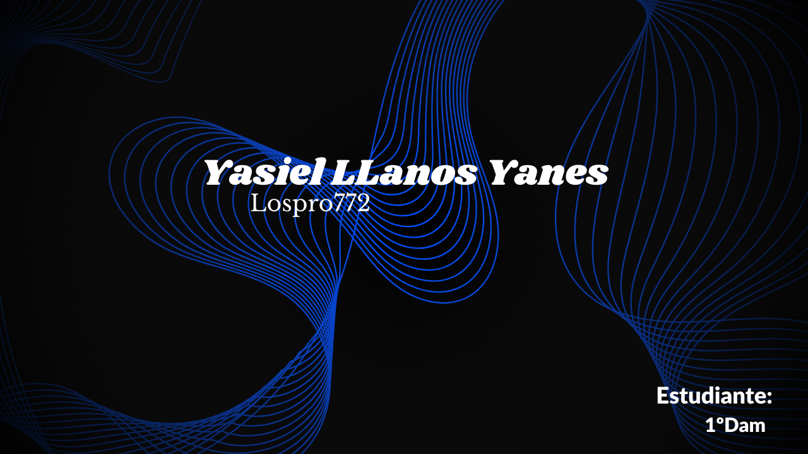

 

<h1>🖐️ Hola, soy Yasiel Llanos Yanes</h1>

🖥️ Actualmente estudiante de **Desarrollo de Aplicaciones Multiplataforma (DAM)** 
🚀 Estudiando en: IES Telesforo Bravo (2025-2026)

💻 Tech Stack: 

Languages: 

 
IDE: 

 
DataBases: 

<h1>🖐️ Contacto</h1>

  

<!--
**Lospro772/lospro772** is a ✨ _special_ ✨ repository because its `README.md` (this file) appears on your GitHub profile.

Here are some ideas to get you started:

- 🔭 I’m currently working on ...
- 🌱 I’m currently learning ...
- 👯 I’m looking to collaborate on ...
- 🤔 I’m looking for help with ...
- 💬 Ask me about ...
- 📫 How to reach me: ...
- 😄 Pronouns: ...
- ⚡ Fun fact: ...
-->

